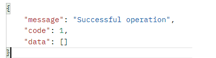

# ff5-images

### Descripción

Básicamente una API Rest hecha totalmente en PHP, sin frameworks ni
conservantes ni colorantes(salvo los que quizá me haya comido en el proceso :))
 
La API viene a resolver los requisitos funcionales del enunciado orientándome 
a mi lenguaje de mayor dominio, PHP.

### Tecnologías utilizadas

- PHP 8.2.12
- Base de datos relacional MariaDB 
- Servidor Web Apache versión 2.4.58
- Postman(11.22) para probar los endpoints de la API.
- Librería Guzzle(7.9) para el testing automizado de endpoints.
- Librería PHPUnit(11.4) para el testing automatizado de endpoints.
- Librería ImageIntervention(2.0) para el tratamiento de imágenes.
- Todo esto desarrollado y testado en un SO Windows 10 Pro 64 bits

### Instalación
- Para garantizar la instalación del servidor Web Apache y del servidor
de BBDD MariaDB recomendamos instalar [XAMPP](https://www.apachefriends.org/es/index.html), que, además, incorporará la instalación de PHP si este no estuviera ya instalado.
- Dentro de la carpeta xampp/htdocs clonamos el repositorio.
- Una vez clonado, se habrá generado la carpeta "ff5-images", entramos a ella y
ejecutamos el comando

*composer install*

- En el mismo proyecto se incluyen la carpeta "database", dentro están tanto los *scripts*  de creación de la base de datos de test("create_test.sql") y de producción "create.sql").

- Copiando y pegando cada uno de los *scripts* en un gestor de Base de datos vinculado a una conexión de BD(por ejemplo "phpmyadmin")

- En el fichero config.php podemos indicar las credenciales de nuestra conexión
a servidor de base de datos.

- Por último, para utilizar la edición de imágenes de la API necesitaremos
habilitar el driver "gd" en PHP. Para ello, necesitaremos editar el archivo php.ini. Recuerda que para acceder a tal archivo podemos hacerlo desde la consola de XAMPP pulsando el botón "Config" de la fila Apache y luego "php.ini" o directamente desde el explorador de archivos. Descomentamos la línea(es quitar el ";") para que quede:

*extension=gd*

Y ya deberíamos empezar a poder jugar :)

### Instrucciones de uso

Como buena API REST su punto de entrada son los *endpoints*. No he podido
crear un cliente que lo consumiera así que recomiendo [Postman](https://www.postman.com/) para trastear.

Y a esto se juega así:

Partiendo de la URL base: http://localhost/ff5-images/

#### GET images("Como usuario será necesario poder ver una lista de mis imágenes (imagen y un título)")

##### Url completa: GET http://localhost/ff5-images/images

##### Body request: 
Vacío
##### Respuestas:
Devuelve un array de JSON con imágenes, si las hay. 

O error sino:

#### GET images por id("Como usuario será necesario poder ver una lista de misimágenes (imagen y un título)")

##### Url completa: GET http://localhost/ff5-images/images/{id}

##### Body request: 
Vacío
##### Respuestas:
Devuelve un JSON con la imagen solicitada,si existe.

Sino, informará  de su no existencia.

#### POST images("Como usuario será necesario poder añadir imágenes a una base de datos")
##### Url completa: POST http://localhost/ff5-images/images

##### Body request: 

##### Respuestas:
Crea e inserta la imagen en el sistema: 

O muestra un error de los varios que se controlan(p.e: "campos vacíos","título incorrecto..")

#### PUT images("Como usuario será necesario poder editar una imagen existente")

##### Url completa: PUT http://localhost/ff5-images/images/{id}

##### Body request: 

**Nota: El cuerpo lo ponemos en un JSON crudo**

##### Respuestas:
Modifica la imagen o el título de la misma.

O muestra un error:

#### DELETE images("Como usuario será necesario poder eliminar una imágen")

##### Url completa: DELETE http://localhost/ff5-images/images/{id}

##### Body request: 

Vacío

##### Respuestas:

Elimina la imagen de memoria y de base de datos.

O muestra un error:

### Testing

- Desde el directorio raíz del proyecto, mediante el comando:

*vendor/bin/phpunit tests*

- En el fichero "config.php" podemos alternar el valor de 'env' entre 'prod' 
y 'dev' para usar la base de desarrollo de producción o de testing.

### Explicación del desarrollo

He optado por hacer una API REST en PHP puro ya que es el lenguaje en el que mejor me manejo y en el que entendí que era entonces mejor hacer la prueba.  Sí que es cierto que en PHP puro quizá el resultado no sea muy espectacular visualmente(aunque la armonía en *backend* también existe ;)) pero es lo que me ha nacido hacer.

No he querido usar *frameworks*(que es lo que probablemente haría por temas de velocidad de producción y fiabilidad) por lo mismo que a menudo le digo a mis alumn@s que, más interesante que dominar *frameworks* es dominar los lenguajes que los fundamentan. Que los *frameworks* van y vienen con más frecuencia que los lenguajes que los fundamentan y porque creo que se ve más de mi como programador haciendo las cosas "a mano" que no usando comandos de *frameworks*

Entonces, en base a como lo he hecho, espero que los errores que haya podido cometer, o las mejoras y comentarios que me podáis sugerir amplien mis límites un poquito más allá :)

A partir de aquí empiezan toda una serie de viscisitudes que me han ocurrido en la confección de este código que quizá puedan resultar de interés(o no)

Gracias si has llegado a leer hasta aquí! :D 

### Flujo de ejecución del programa

- La fiesta empieza en **api.php**(gracias, .htaccess) Se encarga de recibir la petición HTTP, captar la información útil y enviarla al enrutador de router.php
- El código fuente de **router.php** no está precisamente escrito por Shakespeare(o quizá sí por lo enrevesado) el caso es que se encarga de dirigir la petición(y su información necesaria) al método correspondiente de...
- **ImagesController**, que valida a petición, la procesa(apoyándose en el **Model Image**) y devuelve la respuesta correspondiente. Las respuestas "positivas"(las que no son errores) se hallan en la carpeta **Responses**
- Dentro de la misma carpeta **Controllers** hay la carpeta **Request Validators** que contiene normas de validación para algunas peticiones en particular(POST y PUT) clases con tales normas de validación(carpeta **Validators**) 
- Cada norma de validación está vinculada a un mensaje de error representado por las clases de la carpeta **Errors**
- En la carpeta **Models** aparte del único modelo que utilizo(Image) también
se hallan las clase que encapsula la lógica de transformación de una Imagen(Carpeta **Image Tranformations**)
- En la carpeta **tests**, lógicamente, hay tests :). Molaría que hubiera patatas, pero no :(
- Y es en la carpeta **uploads** donde se guardan las imágenes "en físico".
- **config.php** es un poco el archivo de configuración de entorno de desarrollo y de datos de conexión de BD que utiliza el fichero **Database.php** para establecer conexiones a la misma.

### Comentarios sobre el desarrollo,decisiones tomadas y otras batallitas

- He usado *Gitflow*. Me siento cómodo trabajando así, y he dejado jugosos titulares en commits y PRs :)
- No estoy especialmente acostumbrado a trabajar en TDD, eso creo que se notará en los tests que he hecho. Sin embargo, me resulta útil para clarificar
QUÉ tengo que programar, que a menudo es lo más dificil de este oficio.
- De hecho, hay dos tests ahora mismo que estoy *skippeando* porque no consigo, en entorno de test, recrear exactamente lo mismo que hace la funcionalidad. En fin, ya me saldrá.
- No he pasado ningún tipo de filtro de formato, aunque he intentado respetar
un mínimo de estándars PSR.
- No se trata de un API pensada para **imágenes de alta calidad**. 5 MB el máximo, y vamos que chutamos :)
- Una cosa que se me planteó al principio era incluir usuari@s. Luego el tiempo no me daba así que lo descarté.
- De haber incluido un recurso más(Usuari@s, por ejemplo) hubiera dando la bienvenida a otros patrones chachi como **Repository**, y demás.
- Al ser más bien un CRUD, tampoco creí necesario incluir una capa de  
**Service**
- Una cosa que no me gusta de mi diseño es que, el único modelo que utilizo, **Image**, tiene demasiadas responsabilidades. Sería de las primeras cosas que refactorizaría de ir creciendo esto.
- Con usuari@s también habría creado una carpeta para cada un@ en **uploads**
- No me la he jugado mucho tampoco con los formatos de imagen(jpg,png,gif,webp)
- No detesto *frontend*, es solo que ahora estoy en una época muy *back*. Me hubiera gustado hacer un cliente digno para consumir la API.
- Añadir campos del estilo "**created_at**" y "**updated_at**" en imagenes hubiera estado bien :)
- Los tests quizá sobrecarguen la carpeta "uploads". Sorry :P
- Poner efectos a las imágenes ha sido la única nota original que creo haber
podido aportar a vuestra idea. Hacer un PUT solo para cambiar un *string* me parecía muy rácano. Y más efectos que hubiera puesto con algo más de tiempo. Menuda maravilla **ImageIntervention**!.
- Un *deploy* de todo esto tampoco habría sido mala cosa...:'(

En fin, espero que disfrutéis revisando esto más o menos la mitad o más de lo que yo he disfrutado haciéndolo ^_^

